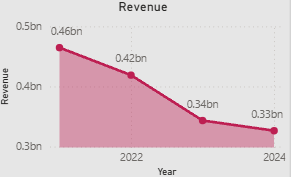
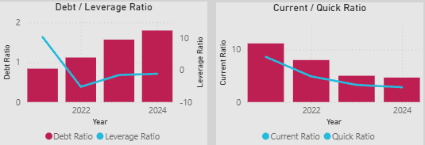
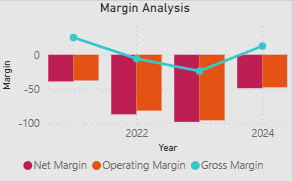
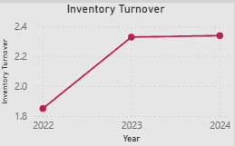

# Beyond Meat Financial Health Analysis (2021–2024)

## Project Overview
This project provides a **consulting-style financial analysis** of Beyond Meat, Inc. over four years, focusing on profitability, liquidity, solvency, operational efficiency, and cash flow.  
The analysis uses SQL for data preparation, Python for calculations, and Power BI for visualization.  

**Tools & Deliverables:**  
- SQL scripts for financial data cleaning and ratio calculations  
- Python scripts for data preprocessing and metrics computation  
- Power BI dashboard with interactive KPIs and charts  
- Final written report in Word  

---

## Business Challenge
Beyond Meat has faced declining revenue, negative operating margins, and high leverage over recent years. The challenge was to evaluate the company’s **financial health**, identify **key stress points**, and provide **actionable recommendations** to improve profitability and sustainability.  

---

## Key Findings

### 1. Profitability Trends
Beyond Meat continues to struggle with deeply negative net and operating margins, despite some recovery in gross margin in 2024.  
  

### 2. Liquidity & Solvency
Liquidity remains high but declining. Debt now exceeds assets, with negative equity indicating severe solvency risk.  
  
  

### 3. Cash Flow & Operational Efficiency
Operating cash flow is below net income, and inventory turnover, while improving, remains below industry benchmarks.  
  
  

---

## Recommendations & Business Impact
- **Optimize Cost Structure:** Reduce SG&A and R&D by 15–20% to improve profitability.  
- **Revise Pricing & Supplier Contracts:** Stabilize volatile gross margins.  
- **Strengthen Working Capital:** Improve inventory turnover and cash collections.  
- **Debt Restructuring:** Monitor solvency and consider equity or refinancing.  
- **Strategic Partnerships:** Explore joint ventures to boost revenue and reduce financial risk.  

**Business Impact:**  
Implementing these measures could reduce operating losses, improve cash generation, and stabilize Beyond Meat’s financial trajectory, supporting sustainable growth.

---

## Deliverables
- **SQL scripts**: Data cleaning and ratio calculations  
- **Python scripts**: Financial metrics computation  
- **Power BI dashboard**: Interactive charts and KPIs  
- **Word report**: Comprehensive analysis with narrative insights  
- **Charts/images**: Visual support for key findings (in `images/` folder)
